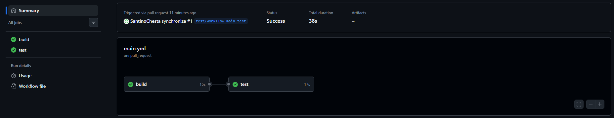
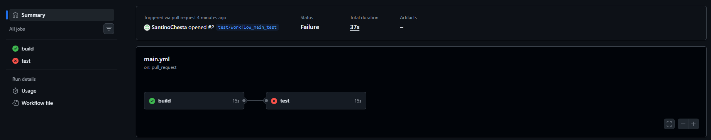

# TP — GitHub Actions (CI/CD)

- main.yml: Se llama cuando se hace una pull request o se actualiza la rama que participa en una ya existente
- release.yml : Se llama cuando
- build: Instala java en su verison 17(incluyendo maven y todas sus dependencias) con la distribucion de temurin y ejecuta el comando mvn compile en la carpeta que contiene el TP-4
- test: Instala java en su verison 17(incluyendo maven y todas sus dependencias) con la distribucion de temurin y ejecuta el comando mvn test en la carpeta que contiene el TP-4

Se hizo una pull request a la rama test/workflow_main_test que solo contenia commits con archivos .txt vacios para comprobar que funciona y luego se modifico el test ThresholdAlertServiceTest para que falle

Workflow sin alterar los test

Workflow tras alterar los test

